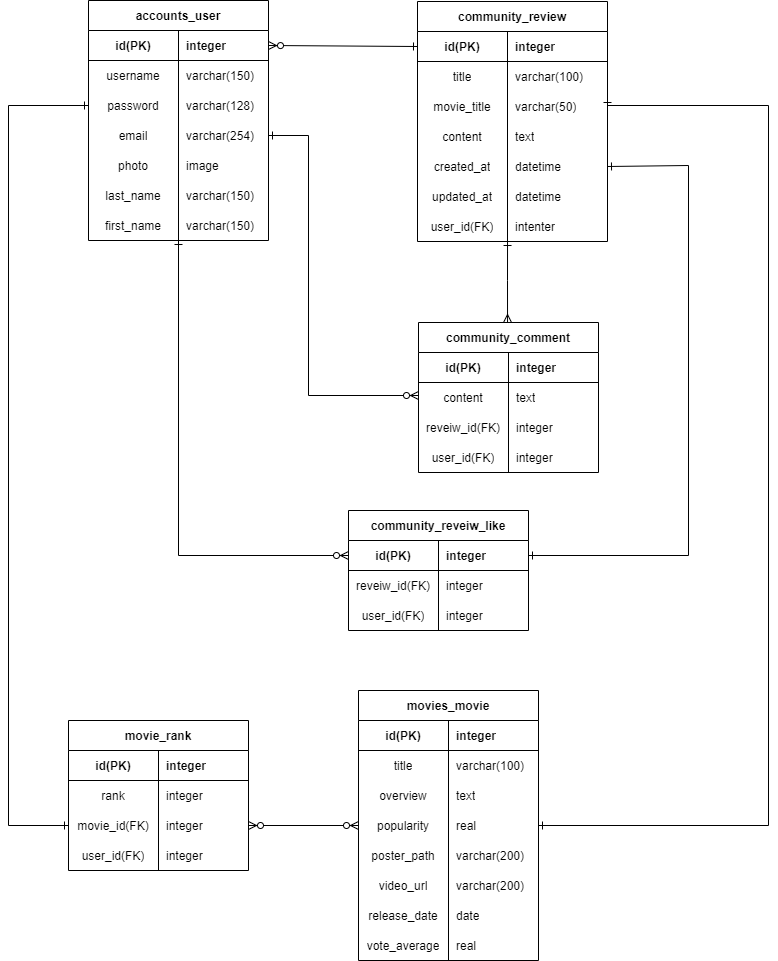

# README

## 팀원 정보 및 업무 분담 내역

---

- 김나영
  - App-accounts 기능 구현 및 Design
- 박상훈
  - App-movies, community 기능 구현 및 Design

## 개발 환경

---

- 언어
  - Python 3.9.6
  - Django 3.2.9
- 도구
  - VSCode
  - Chrome Browser
- 아키텍처
  - Django & Vanila JS
- 사용 API
  - The Movie Database (TMDB)
  - google OAuth

## 목표 서비스 구현 및 실제 구현 정도

---

### 관리자 뷰

- [x] 관리자 권한의 유저만 영화 등록/수정/삭제 권한
- [x] 관리자 권한의 유저만 유저 관리 권한을 가짐
- [x] 장고 admin 기능을 이용하여 구현

### 영화 정보

- [x] 최소 50개 이상의 데이터
- [x] 모든 로그인 된 유저는 영화에 대한 평점/등록/삭제 등 가능

### 추천 알고리즘

- [x] 평점을 등록한 유저는 해당 정보를 기반으로 영화를 추천 받을 수 있어야 한다
- [x] 사용자는 반드시 최소 1개 이상의 방식으로 영화를 추천 받을 수 있어야 한다
- [x] 어떠한 방식으로 추천 시스템을 구성했는지 설명

### 커뮤니티

- [x] 영화 정보와 관련된 대화를 할 수 있는 커뮤니티 기능을 구현
- [x] 로그인된 사용자만 글을 조회/생성할 수 있으며 작성자 본인만 글을 수정/삭제
- [x] 사용자는 작성된 게시 글에 댓글을 작성할 수 있어야 하며, 작성자 본인만 댓글 삭제 가능
- [x] 각 게시글 및 댓글은 생성 및 수정 시각 정보가 포함되어야 한다

## 개발 일정

---

| 11월 17일                         | 11월 18일                                 | 11월 19일          | 11월 22일          | 11월 23일           | 11월 24일               | 11월 25일      |
| --------------------------------- | ----------------------------------------- | ------------------ | ------------------ | ------------------- | ----------------------- | -------------- |
| 기획 및 웹 프로토 타입 제작       | 모델 디자인 (accounts, community, movies) | 추천 알고리즘 진행 | 알고리즘 재구상    | 웹 디자인 개선      | 프로필 사진 업로드 구현 | 웹 배포        |
| 로그인, 회원가입 기능 구현        | 구글 로그인 기능 추가                     | 프로필 페이지 구현 | 프로필 페이지 개선 | 영화 검색 기능 구현 | 유튜브 영상 불러오기    | 최종 점검      |
| api 사용하여 영화 데이터 가져오기 | 영화 평가 기능 추가                       | 팔로우 기능 구현   | vue 도전           |                     | 반응형 웹 구현          | 발표 자료 준비 |
| erd 구현                          | 댓글 삭제 기능 추가                       |                    |                    |                     |                         |                |

## 데이터베이스 모델링 (ERD)

---



## 필수 기능에 대한 설명

---

### 메인 페이지

- 구성: 인기 영화, 최근 개봉작, 개봉 예정작, 추천 영화, 랜덤 추천
- 영화 평점 등록
- 영화 추천 알고리즘
- 영화 검색 기능

### 커뮤니티

- REVIEWS (작성된 모든 리뷰 표시)
- CREATE (리뷰 작성 기능)

### 프로필

- 구성: 게시물, 팔로워, 팔로잉 수 표시, 작성한 게시물, 댓글, 평가한 영화 표시
- 프로필 사진 변경 기능

## 개발 과정

---

## 사전 사항

- movies/fixtures/data.py 실행
  - TMDB API에서 인기 영화 정보를 추출하여 movies.json으로 생성

```bash
$ python manage.py loaddata movies.json
```

- 생성된 movies.json 파일을 데이터로 불러오기

## movies

### 메인 페이지

- 인기 영화, 추천 영화, 최신 개봉 영화, 개봉 예정 영화 순으로 나열
- 배운 내용들을 최대한 활용해보고자 navbar 상단고정과 footer 디테일 추가


### 영화 추천 기능

로그인 유저와 다른 유저들의 영화에 대한 **평가가 존재**할 때 유저간 유사도 분석을 통해 영화를 추천하도록 했다. 

- 사용 알고리즘 - 피어슨 상관계수


```python
# views.py

import pandas
import numpy
from django.db.models import Q

# 유저간 유사도 구하기 : 피어슨 상관계수
def pearson(s1, s2):
    s1_c = s1 - s1.mean()
    s2_c = s2 - s2.mean()
    return numpy.sum(s1_c * s2_c) / (numpy.sqrt(numpy.sum(s1_c ** 2) * numpy.sum(s2_c ** 2)))

def recommended(request):

    # 유저가 등록한 평점과 다른 유저가 등록한 평점이 존재한다면
    if Rank.objects.filter(user_id=request.user) and Rank.objects.filter(~Q(user_id=request.user)):

        # 유저의 평점 데이터 불러오기
        ranks = pandas.DataFrame(data=Rank.objects.all().values('user', 'movie', 'rank'))
        ranks = ranks.rename(columns={'user':"userId", 'movie':"movieId"})

        # 영화 데이터에서 id값 가져오기
        movie = pandas.DataFrame(data=Movie.objects.all().values('id'))
        movie = movie.rename(columns={'id':'movieId'})

        # 평가하지 않은 데이터는 NaN값으로
        movie.movieId = pandas.to_numeric(movie.movieId, errors='coerce')
        ranks.movieId = pandas.to_numeric(ranks.movieId, errors='coerce')

        # 데이터 통합 후 피벗 테이블 생성
        data = pandas.merge(ranks, movie, on='movieId', how='inner')
        matrix = data.pivot_table(index='movieId', columns='userId', values='rank')
        result = []

        # 다른 유저들과 유사도 검사
        for side_id in matrix.columns:
            
            if side_id == request.user.id:
                continue
            
            # 유저간 유사도 검사
            cor = pearson(matrix[request.user.id], matrix[side_id])

            # 평점이 NaN 값이면 0으로 입력
            if numpy.isnan(cor):
                result.append((side_id, 0))
            else:
                result.append((side_id, cor))

        # 가장 유사한 유저 값 생성
        result = max(result, key=lambda r: r[1])[0]

        # 자신이 평가한 영화 id값
        movies = Rank.objects.filter(user_id=request.user.id).values('movie_id')
        movies = [value['movie_id'] for value in movies]

        # 유사 유저가 평가한 영화 id값
        sim_movie = Rank.objects.filter(user_id=result).values('movie_id')
        
        # 내가 보지 않은 영화 id 후보 결정
        id_list = [value['movie_id'] for value in sim_movie if value['movie_id'] not in movies]
        recommends = Movie.objects.filter(id__in=id_list).order_by('-popularity')
        recommends_count = recommends.count()

        # 추천 영화가 충분하지 않으면
        if recommends_count < 4:
            return None

        return recommends[:4]

    return None
```

- 로그인 유저가 평가한 영화 정보가 존재할 경우


- 로그인 유저가 평가한 영화 정보가 없거나 적을 경우
  - 랜덤으로 추천


### 영화 검색 기능

```python
# views.py

def search(request):
    movies = Movie.objects.all()
    q = request.POST.get('q', "") 
    if q:
        movies = movies.filter(title__icontains=q).order_by('release_date')
        context = {
            'movies' : movies,
            'q' : q,
        }
        return render(request, 'movies/search.html', context) 
    return render(request, 'movies/search.html')
```

- 장고 q 객체를 사용하여 영화 제목에 대한 검색 기능을 구현했다.

- 검색어가 없을 경우, 검색 결과가 없을 경우, 알맞은 검색 결과를 찾았을 경우의 3가지를 표현하도록 했다.

  - 검색어가 없을 경우

    

  - 검색 결과가 없을 경우

    

  - 알맞은 검색 결과를 찾았을 경우

    

### 영화 디테일

- 유튜브에 영화 트레일러 영상이 존재한다면 유튜브 영상 송출


```html
<!-- detail.html -->


    <div id="area">
      <iframe
        id="video"
        src="https://www.youtube.com/embed/{{video_path}}?autoplay=1"
        title="YouTube video player"
        frameborder="0"
        allow="accelerometer; autoplay; clipboard-write; encrypted-media; gyroscope; picture-in-picture"
        allowfullscreen
      ></iframe>
    </div>
  
```

- 영화 세부 정보와 댓글 기능을 통한 영화 평가
  - 영화 평가는 유저별로 1개씩만 가능
  - 유저들의 평균 평점 산출하여 표시
  - 본인 댓글 삭제 및 수정 기능


## community

### 리뷰 화면


```python
# models.py

def created_string(self):
        time = datetime.now() - self.created_at
        if time < timedelta(minutes=1):
            return '방금 전'
        elif time < timedelta(hours=1):
            return str(int(time.seconds / 60)) + '분 전'
        elif time < timedelta(days=1):
            return str(int(time.seconds / 3600)) + '시간 전'
        elif time < timedelta(days=7):
            time = datetime.now().date() - self.created_at.date()
            return str(time.days) + '일 전'
        else:
            return False
```

- 리뷰의 작성시간에 따라 다르게 보여질 수 있도록 하였다.

### 리뷰 디테일


- 리뷰 작성 시간과 마찬가지로 댓글의 작성시간과 수정시간을 표시
- AJAX 통신을 통해 페이지 새로고침 없이 리뷰에 대한 좋아요 수를 반영

```jsx
// detail.html

<script>
  const csrftoken = document.querySelector('[name=csrfmiddlewaretoken]').value
  const likeForm = document.querySelector('#like-form')

  likeForm.addEventListener('submit', event => {
    const reviewId = event.target.dataset.reviewId
    event.preventDefault()
    axios({
      method: 'post',
      url: `/community/${reviewId}/like/`,
      headers: {'X-CSRFToken': csrftoken},
    })
    .then(response => {
      const {isLiked, likes} = response.data
      const likeBtn = document.querySelector("#like-form > button")
      const likeCnt = document.querySelector("#like-cnt")
      if (isLiked) {
        likeBtn.className = "btn btn-link text-danger"
      } else {
        likeBtn.className = "btn btn-link text-secondary"
      }
      likeCnt.innerText = `${likes}`
    })
  })
</script>
```

## accounts

### Social Login

- google OAuth 클라이언트를 통해 별도의 회원가입 필요없이 구글 로그인이 가능하도록 함

  

  ```html
  <!-- accounts -->
  
  
  
  
  <div class="container justify-content-center mt-3" style=" width: 400px;" > 
  	<h1 class="mt-3 text-white">회원가입</h1> 
  	<form class="text-white" method="POST"> 
  		 
  		 
      <br>
  	<input type="submit" class="btn btn-primary" value="Sign Up"> 
  	</form> 
    <br>
    <a href="" class="btn btn-secondary text-white"> 구글 로그인</a>
  </div> 
  
  ```

### profile

- 유저가 작성한 게시글, 팔로워, 팔로잉 수 표시

  - AJAX 통신을 통해 페이지 새로고침 없이 팔로우가 반영되도록 함

  ```jsx
  // profile.html
  
  <script>
      const csrftoken = document.querySelector('[name=csrfmiddlewaretoken]').value
      const followForm = document.querySelector('#follow-form')
      const isSame = document.querySelector('#is-same')
      const {personId, userId} = isSame.dataset
  
      if (personId !== userId) {
        followForm.addEventListener('submit', (event) => {
          event.preventDefault()
          axios({
            method: 'post',
            url: `/accounts/${personId}/follow/`,
            headers: {'X-CSRFToken': csrftoken},
          })
            .then(response => {
              const {isFollowed, followings, followers} = response.data
              const followBtn = document.querySelector('#followBtn')
              const followIcon = document.querySelector('#followIcon')
              const followerCnt = document.querySelector('#follower-cnt')
              
  
              if (isFollowed) {
                followBtn.className = 'btn btn-secondary btn-block'
                followIcon.className = 'fas fa-users-slash'
              } else {
                followBtn.className = 'btn btn-primary btn-block'
                followIcon.className = 'fas fa-user-friends'   
              }     
              followerCnt.innerText = `${followers}`
            })     
        })  
      }
    </script>
  ```

- 작성후기, 작성 댓글, 평가한 영화를 표시하여 클릭하면 해당 게시물로 이동

- 정보 수정에서 프로필 사진 변경 가능

  유저 모델에 photo 추가하여 유저가 올린 파일을 저장하도록 함

  ```python
  # models.py
  
  class User(AbstractUser):
      followings = models.ManyToManyField('self', symmetrical=False, related_name='followers', blank=True)
      photo = models.ImageField(upload_to='images/', blank=True)
  ```

  

- 본인 프로필을 보는 경우

  - 정보 수정, 회원탈퇴 기능 구현

  

- 다른 유저의 프로필을 보는 경우

  - 유저간 팔로우 기능

  

## 배포 서버 URL

---

- aws → 도메인 구매 (ssafy.site)
- [http://ssafy.site/](http://ssafy.site/)

## 느낀 점 및 기타

---

### git 협업 오류들...

<aside>
💡 git brach를 까먹고 파일을 수정할 때 마다 pull과 push에서 수 많은 오류를 겪었다. git brach를 까먹었을 때는 'git stash'(수정 파일 임시 저장)를 사용한다. git stash를 사용하면 pull과 push 오류를 해결할 수 있었다.


</aside>

- 김나영
  - bootstrap을 사용한 웹 디자인을 오랜만에 다시 하려니까 기본적인 것도 기억이 나지 않아서 오래 걸렸다. 예전에 했던 프로젝트나 과제들을 많이 참고해서 프로젝트를 진행했다. 이번 프로젝트에서 bootstrap의 다양한 기능들을 활용해 볼 수 있었다.
  - 앞선 프로젝트들에서도 git으로 협업을 했었지만 몇번을 해도 아직까진 git의 오류에서 벗어나지 못했다. 아무래도 하나의 git에서 함께 수정하며 진행하는 프로젝트라 서로 pull과 push하는 과정에서 오류가 발생했던것 같다. git branch를 습관화하며 git 협업에 익숙해져야겠다고 생각했다.
  - 프로젝트 직전에 배웠던 django로 back-end, vue로 front-end를 구현하는 방식을 사용하지 못해서 아쉬웠다. 처음에 django로 기본적인 부분을 구현하고 vue로 확장하고자 했지만 데이터 직렬화 같은 부분에서 어려움을 느꼈다. 다음에는 시작할 때부터 체계적으로 back-end와 front-end를 나눠야겠다고 생각했다. 이번 프로젝트를 통해서 django를 많이 배울 수 있었다. 방학 기간 동안 vue를 사용하여 개인적인 웹을 만들어봐야겠다고 생각했다.
  - 마지막 배포를 위해 aws cloud9에서 환경설정을 할 때 계속해서 `ModuleNotFoundError: No module named '_bz2'` 라는 오류가 떴다. 오류 해결을 위해 `sudo apt-get install libbz2-dev` 명령어를 통해 설치해주고자 했지만 오류 또한 `Abort.` 라는 오류가 계속해서 발생했다. aws 계정의 권한 문제인가 싶어서 새로운 계정을 만들어서 진행해도 똑같은 오류가 계속됐다. 일단 프로젝트는 페어님의 aws를 통해 구현하긴 했지만, 오류 해결 방법을 찾아봐야겠다고 생각했다.
- 박상훈
  - 본격적으로 데이터베이스를 다루면서 알고리즘을 생성하여 원하는 기능을 구현하는 작업을 진행하였다. 어떠한 알고리즘을 사용할지 생각하는 것이 막막하였지만 통계적 방법을 찾아내어 원하는대로 구현할 수 있어서 뿌듯했다. 앞으로 back-end 직무를 하게 된다면 더 복잡하고 완성도 높은 알고리즘을 구현할 수 있어야 할텐데 많은 알고리즘 공부가 필요하겠다.
  - 처음 계획했던 django와 Vue를 분리하여 front-back을 구현하고자 했던 목표는 이루지 못하였다. django로 너무 많은 과정을 진행한 후 였기 때문에 Vue로 데이터를 전송하는 과정에서 어려움을 겪었고 어쩔수 없이 django만 사용하여 진행하게 되었다. 이번 프로젝트는 아쉽게 되었지만 앞으로 진행하게 될 다른 프로젝트에 큰 도움이 될만한 경험을 하였다.
  - web service를 하는 과정에서 `No module named '_bz2'` 발생하여 애를 먹었다.  이는 pandas를 이용하여 데이터베이스 조작을 하는 과정에서 '_bz2' 모듈이 AWS상에서 제대로 설치가 되지 않아서 발생하는 문제였다. 이를 pyenv로 python을 설치하기 전 미리 설치해 주는 과정을 통해 해결할 수 있었다. git과 python으로만 터미널을 조작하다가 ubuntu를 사용하여 조작하려고 하니 낯설어서 어려움이 많았지만 구글링과 pair와의 협업으로 무사히 해결할 수 있었다.
  - 개인적으로 bootstrap을 사용하여 사용자 친화적인 website를 만드는 것에 흥미가 좀 더 생긴것 같다. 많이 부족하지만 앞으로 많이 학습하여 design이 수려하고 사용자들이 사용하기 편한 website를 만들고 싶다.